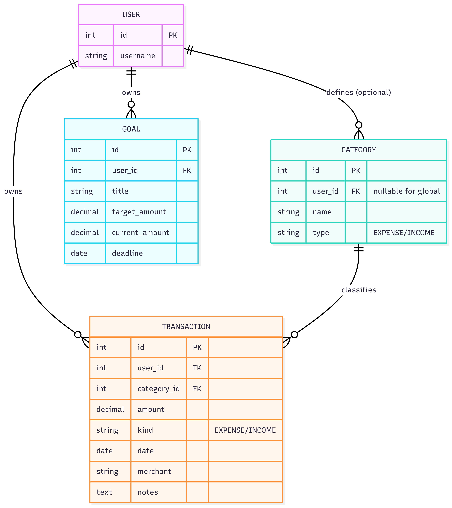

# FinTrack - Personal Finance Dashboard

A Django app to log expenses/income, set savings goals, and view analytics. Track monthly breakdowns with charts and export reports.

Summary of my data model -
- Transactions belong to a User and a Category (on_delete=PROTECT keeps history).
- Categories can be global (user=None) or user-specific and are unique per (user, name, type).
- Goals are unique per (user, title) and store target/current progress.

*Backup: ER diagram exported from mermaid.live*

Constraints (documented):
Category - UniqueConstraint(user, name, type)
Goal -UniqueConstraint(user, title)
Transaction.category uses on_delete=PROTECT (preserve history)
Default ordering - Transaction newest first, category by type/name; Goal by deadline.

Assignment 4 update - I wired two function based views for the Transactions list. One view returns an HttpResponse using loader.get_template() and the other uses the render() shortcut. Both share the same template (transaction_list.html) that extends base.html and implements a  …  state.

A5 Update - I added two class based views for transactions. One uses a base CBV with manual get() and the other uses a generic ListView. Templates extend base.html and include  loops with . I hve also refactored URL structure to include app urls separately.

A3 update - tightened data constraints. Category uniqueness split into scoped and global constraints so transactions now validate that their kind matches the linked category and require positive amounts.

A6 update - Added a Financial insights dashboardthat allows multi field filtering (basically search, category, date range, amount range) on transactions. The page displays dynamic aggregations including overall totals, spending breakdown by category with visual progress bars, top merchants by spending, and monthly spending trends. All aggregations update based on active filters.